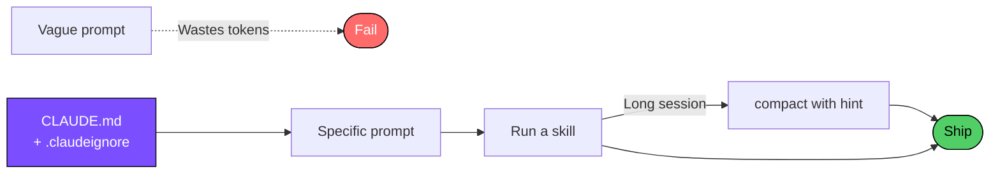

<div align="center">

# Claude Code Practices

### A field-tested playbook for using Claude Code without burning tokens.

[](https://github.com/berkcangumusisik/claude-code-practices/stargazers)
[](https://github.com/berkcangumusisik/claude-code-practices/network/members)
[](LICENSE)
[](skills/README.md)
[](https://claude.com/claude-code)

<br>

**English** · [**Türkçe**](README.tr.md) · [Full Guide](en/README.md) · [Cheatsheet](CHEATSHEET.md) · [Skills](skills/README.md) · [Contributing](CONTRIBUTING.md)

</div>

---

> **Week 1 with Claude Code, I typed:** *"improve this project."*
>
> Claude read 4 files, edited 2, broke 1. **34,000 tokens.** Nothing was fixed.
> I typed `/cost`. **$0.09 for zero work.**

After a month of figuring out what actually works, the same changes now ship with **60–70% fewer tokens**. This repo is the condensed version.

---

## The 3 Things That Mattered Most

### 1. Specific prompts cost 8.5× less

```diff
- "improve this project"                             → 34,000 tokens
+ "add RFC 5322 validation to validateEmail()
+  at src/auth/login.ts:87"                          →  4,000 tokens
```

Same outcome. One-eighth the cost.

### 2. `/compact` is useless without an instruction

```bash
# Trims almost nothing
/compact

# Cuts 70% of context, quality unchanged
/compact Keep only changed functions and relevant test output
```

In one long session this took me from **82,000 → 11,000 tokens**.

### 3. `.claudeignore` is doing nothing for you right now

```gitignore
node_modules/
dist/
*.log
coverage/
*.lock
```

Six lines. File reads drop **3× to 10×** depending on the project.

---

## What's In This Repo

<table>
<tr>
<td width="34%" valign="top">

#### [Skill Library →](skills/README.md)
**82 ready-made slash commands.**
Copy to `.claude/skills/`, invoke with `/name`.

```bash
cp -r skills/ .claude/skills/
```

</td>
<td width="33%" valign="top">

#### [Full Guide →](en/README.md)
Shortcuts, hooks, CLAUDE.md, permission modes, MCP, subagents.
All in one file.

</td>
<td width="33%" valign="top">

#### [Cheatsheet →](CHEATSHEET.md)
Bookmark-worthy one-pager. Everything you'll reach for twice a day.

</td>
</tr>
</table>

---

## Skill Library

<details open>
<summary><b>82 skills across categories — click to fold</b></summary>

<br>

| Category | Count | Examples |
|---|:-:|---|
| Git & GitHub | 13 | `/fix-issue` · `/pr-review` · `/commit` · `/release-notes` |
| Testing | 7 | `/test-generate` · `/test-coverage` · `/test-e2e` |
| Frontend | 9 | `/component-gen` · `/seo-check` · `/state-audit` |
| Backend | 10 | `/api-endpoint` · `/auth-middleware` · `/rate-limiter` |
| Mobile | 4 | `/react-native-component` · `/mobile-perf` · `/expo-setup` |
| Security | 3 | `/security-audit` · `/secret-scan` · `/dependency-audit` |
| Database | 6 | `/migration-gen` · `/query-optimize` · `/schema-review` |
| + more | ... | [See all →](skills/README.md) |

</details>

---

## The Workflow



---

## Quick Start

```bash
# 1. Clone
git clone https://github.com/berkcangumusisik/claude-code-practices.git

# 2. Drop skills into your project
cp -r claude-code-practices/skills ./.claude/skills

# 3. Try one
claude
> /commit
```

---

## Where To Start

| If you're... | Start here |
|---|---|
| New to Claude Code | [Cheatsheet](CHEATSHEET.md) |
| Paying too much in tokens | [Token optimization](en/README.md#3-token-optimization) |
| Rewriting the same prompts | [Skill Library](skills/README.md) |
| Sharing conventions with a team | [CLAUDE.md templates](en/README.md#4-claudemd) |

---

## FAQ

<details>
<summary><b>Does this work with Claude 4.6 / 4.7?</b></summary>

<br>Yes. Every skill and pattern here is model-agnostic — they're about how you prompt Claude Code, not which model it's pointed at.
</details>

<details>
<summary><b>Do I need to copy all 82 skills?</b></summary>

<br>No. Start with 3–5 you'd actually use this week. Add more as the pain points show up.
</details>

<details>
<summary><b>Will <code>.claudeignore</code> break anything?</b></summary>

<br>No. It only controls what Claude reads — your build and editor are unaffected.
</details>

<details>
<summary><b>How do I measure the savings?</b></summary>

<br>Run <code>/cost</code> before and after a session. The numbers in this README are from my own <code>/cost</code> outputs, not estimates.
</details>

<details>
<summary><b>Can I use this for a team?</b></summary>

<br>Yes. Commit <code>.claude/skills/</code> and a <code>CLAUDE.md</code> to your repo and the whole team picks them up automatically.
</details>

---

## Contributing

Found a better pattern, wrote a skill, spotted a bug? PRs welcome. See [CONTRIBUTING.md](CONTRIBUTING.md).

<a href="https://github.com/berkcangumusisik/claude-code-practices/graphs/contributors">
  
</a>

---

## Star History

<a href="https://star-history.com/#berkcangumusisik/claude-code-practices&Date">
  <picture>
    <source media="(prefers-color-scheme: dark)" srcset="https://api.star-history.com/svg?repos=berkcangumusisik/claude-code-practices&type=Date&theme=dark" />
    <source media="(prefers-color-scheme: light)" srcset="https://api.star-history.com/svg?repos=berkcangumusisik/claude-code-practices&type=Date" />
    
  </picture>
</a>

---

<div align="center">

**If this saved you tokens, drop a star.** That's how the next person finds it.

<sub>Built by <a href="https://github.com/berkcangumusisik">@berkcangumusisik</a> · MIT License</sub>

<br>

[↑ back to top](#claude-code-practices)

</div>
