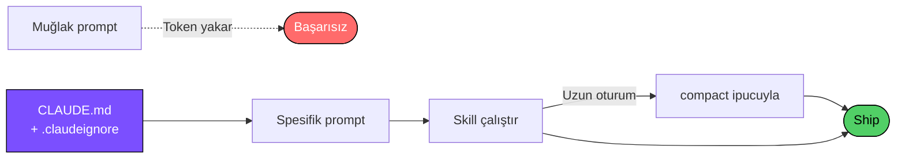

<div align="center">

# Claude Code Practices

### Claude Code'u token yakmadan kullanmak için saha-denenmiş bir rehber.

[](https://github.com/berkcangumusisik/claude-code-practices/stargazers)
[](https://github.com/berkcangumusisik/claude-code-practices/network/members)
[](LICENSE)
[](skills/README.md)
[](https://claude.com/claude-code)

<br>

[**English**](README.md) · **Türkçe** · [Tam Rehber](tr/README.md) · [Cheatsheet](CHEATSHEET.md) · [Skills](skills/README.md) · [Katkı](CONTRIBUTING.md)

</div>

---

> **Claude Code'u ilk hafta kullanırken yazdığım şey:** *"Bu projeyi iyileştir."*
>
> Claude 4 dosya okudu, 2 dosyayı değiştirdi, birini bozdu. **34.000 token.** Hiçbir şey düzelmedi.
> `/cost` yazdım. **Sıfır iş için $0.09 harcamıştım.**

Son 1 ayda neyin işe yarayıp neyin yaramadığını öğrendim. Aynı işi şimdi **%60-70 daha az token** ile yapıyorum. Bu repo o deneyimin özeti.

---

## En Çok İşe Yarayan 3 Şey

### 1. Spesifik prompt 8.5× daha ucuz

```diff
- "bu projeyi iyileştir"                             → 34.000 token
+ "src/auth/login.ts:87 satırındaki validateEmail()
+  fonksiyonuna RFC 5322 kontrolü ekle"              →  4.000 token
```

Aynı sonuç. Sekizde bir maliyet.

### 2. `/compact` tek başına işe yaramıyor

```bash
# Neredeyse hiçbir şey kesmez
/compact

# Bağlamın %70'ini keser, kalite düşmez
/compact Keep only changed functions and relevant test output
```

Uzun bir oturumda bunu iki kez kullandım. Token sayısı **82.000 → 11.000**.

### 3. `.claudeignore` şu an hiçbir şey yapmıyor

```gitignore
node_modules/
dist/
*.log
coverage/
*.lock
```

6 satır. Claude'un okuduğu dosya sayısı projeye göre **3 ila 10 kat** düşüyor.

---

## Repoda Ne Var

<table>
<tr>
<td width="34%" valign="top">

#### [Skill Kütüphanesi →](skills/README.md)
**82 hazır slash command.**
`.claude/skills/` içine kopyala, `/komut` ile kullan.

```bash
cp -r skills/ .claude/skills/
```

</td>
<td width="33%" valign="top">

#### [Tam Rehber →](tr/README.md)
Kısayollar, hooks, CLAUDE.md, izin modları, MCP, subagents.
Hepsi tek dosyada.

</td>
<td width="33%" valign="top">

#### [Cheatsheet →](CHEATSHEET.md)
Bookmark'lanacak tek sayfa. Günde iki kez bakacağın her şey.

</td>
</tr>
</table>

---

## Skill Kütüphanesi

<details open>
<summary><b>Kategoriye göre 82 skill — tıkla katla</b></summary>

<br>

| Kategori | Adet | Örnekler |
|---|:-:|---|
| Git & GitHub | 13 | `/fix-issue` · `/pr-review` · `/commit` · `/release-notes` |
| Test | 7 | `/test-generate` · `/test-coverage` · `/test-e2e` |
| Frontend | 9 | `/component-gen` · `/seo-check` · `/state-audit` |
| Backend | 10 | `/api-endpoint` · `/auth-middleware` · `/rate-limiter` |
| Mobile | 4 | `/react-native-component` · `/mobile-perf` · `/expo-setup` |
| Güvenlik | 3 | `/security-audit` · `/secret-scan` · `/dependency-audit` |
| Veritabanı | 6 | `/migration-gen` · `/query-optimize` · `/schema-review` |
| + daha fazla | ... | [Tümünü gör →](skills/README.md) |

</details>

---

## Akış



---

## Hızlı Başlangıç

```bash
# 1. Klonla
git clone https://github.com/berkcangumusisik/claude-code-practices.git

# 2. Skill'leri projene kopyala
cp -r claude-code-practices/skills ./.claude/skills

# 3. Birini dene
claude
> /commit
```

---

## Nereden Başlamalı

| Durumun | Buradan başla |
|---|---|
| Yeni başlıyorum | [Cheatsheet](CHEATSHEET.md) |
| Token maliyetim yüksek | [Token optimizasyonu](tr/README.md#3-token-optimizasyonu) |
| Aynı promptları tekrar yazıyorum | [Skill Kütüphanesi](skills/README.md) |
| Ekiple paylaşmak istiyorum | [CLAUDE.md şablonları](tr/README.md#4-claudemd) |

---

## SSS

<details>
<summary><b>Claude 4.6 / 4.7 ile çalışıyor mu?</b></summary>

<br>Evet. Buradaki her skill ve pratik modelden bağımsız — Claude Code'a nasıl prompt verdiğinle ilgili, hangi modeli kullandığınla değil.
</details>

<details>
<summary><b>82 skill'i de kopyalamam gerekiyor mu?</b></summary>

<br>Hayır. Bu hafta kullanacağın 3-5 tanesiyle başla. İhtiyaç belirdikçe ekle.
</details>

<details>
<summary><b><code>.claudeignore</code> bir şey bozar mı?</b></summary>

<br>Hayır. Sadece Claude'un ne okuyacağını kontrol eder — build'in ve editörün etkilenmez.
</details>

<details>
<summary><b>Tasarrufu nasıl ölçerim?</b></summary>

<br>Oturum öncesi ve sonrası <code>/cost</code> çalıştır. Buradaki rakamlar tahmin değil, kendi <code>/cost</code> çıktılarımdan.
</details>

<details>
<summary><b>Ekip için kullanabilir miyim?</b></summary>

<br>Evet. <code>.claude/skills/</code> ve <code>CLAUDE.md</code>'yi repoya commit et, tüm ekip otomatik alır.
</details>

---

## Katkı

Daha iyi bir yöntem bulduysan, yeni bir skill yazdıysan veya hata gördüysen PR aç. [CONTRIBUTING.md](CONTRIBUTING.md)

<a href="https://github.com/berkcangumusisik/claude-code-practices/graphs/contributors">
  
</a>

---

## Star Geçmişi

<a href="https://star-history.com/#berkcangumusisik/claude-code-practices&Date">
  <picture>
    <source media="(prefers-color-scheme: dark)" srcset="https://api.star-history.com/svg?repos=berkcangumusisik/claude-code-practices&type=Date&theme=dark" />
    <source media="(prefers-color-scheme: light)" srcset="https://api.star-history.com/svg?repos=berkcangumusisik/claude-code-practices&type=Date" />
    
  </picture>
</a>

---

<div align="center">

**Token biriktirdiyse bir yıldız bırak.** Bir sonraki kişi böyle bulur.

<sub><a href="https://github.com/berkcangumusisik">@berkcangumusisik</a> tarafından · MIT Lisansı</sub>

<br>

[↑ başa dön](#claude-code-practices)

</div>
